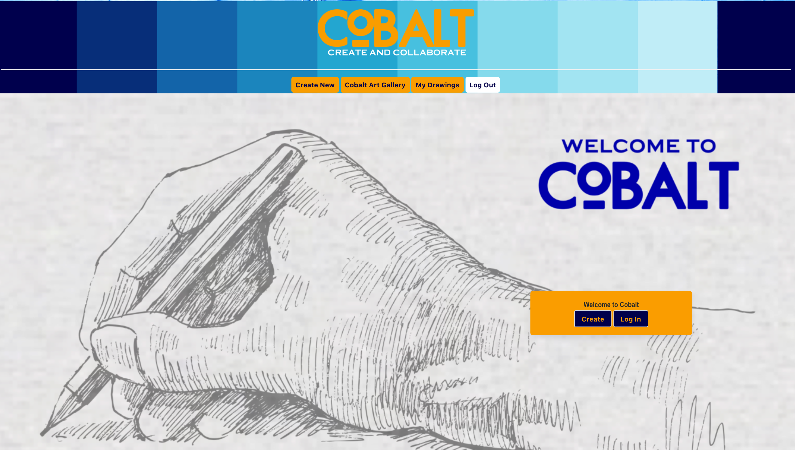

# Cobalt Canvas 👨‍🎨

## Description 
Have you ever wanted to make an art project with a friend?  Cobalt Canvas is for you.  We provide a collaborative art platform to allow you to make art and share it with your friends.  Your friends can make edits and send it back.  While we can’t be together right now, we can make projects together.  Start your project today, and bring your inner creativity out.

## Table of Contents

* [Installation](#installation)
* [Usage](#usage)
* [Credits](#credits)
* [License](#license)
* [Features](#features)
* [Contributing](#contributing)
* [Tests](#tests)
* [Badges](#badges)

## Installation
### Steps required to run locally
1. Clone/download the code in this repo
2. Navigate to the location of the code downloaded
3. Double-click on the html file provided in the downloaded code to preview
### Steps required to run online
1. Click the "VIEW APP" link in this README

## Usage 
This code should be used for the purpose of creating/editing code for a drawing/sharing art application.

## View Website
Click here to view the live website [VIEW APP](https://cobalt-canvas.herokuapp.com/)

## Credits
[John Erler](https://github.com/jerler1)  
[Bradley Donahue](https://github.com/brhue)  
[Daniel Thomas](https://github.com/danielthomas129)  
[Lisa Copeland](https://github.com/stopdaydreaming)    

## License
Copyright (c) Cobalt Canvas. All rights reserved.
Licensed under the [MIT](license.txt) license.

## Features
None at this time

## Contributing
None at this time

## Tests
None at this time  
